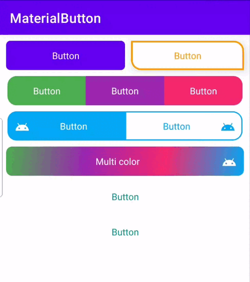

[](https://jitpack.io/#farasource/material-button)
-
Simple Material Button For Android



## Getting Started

To start working with material button, you need to add its dependency into your `build.gradle` file:
### Dependency
```groovy
dependencies {
    implementation "com.github.farasource:material-button:[latest_version]"
}
```

Then you need to add jitpack as your maven repository in `build.gradle`  file:

```groovy
repositories {
    google()
    jcenter()
    maven { url 'https://jitpack.io' }
}
```

## Sample
There is a fully functional sample application that demonstrates the usage of material button, all you have to do is cloning the project and running the [sample](https://github.com/farasource/material-button/tree/master/sample) module.
## How to use

Use material button in the layout pragmatically
```JAVA
MaterialButton materialButton = findViewById(R.id.materialButton);
List<ButtonBackground.DrawableParams> drawableParams = new ArrayList<>();
drawableParams.add(ButtonBackground.DrawableParams.newBuilder()
    .addButtonStateType(-ButtonUtilities.ButtonStateType.ENABLED)
    .setColors(0xffe2e2e2)
    .setRadius(10)
    .setRadius(10, 10, 10, 10)
    .build());
drawableParams.add(ButtonBackground.DrawableParams.newBuilder()
    .addButtonStateType(ButtonUtilities.ButtonStateType.PRESSED)
    .setColors(0xff009688, 0xffE0F2F1, 0xff009688)
    .setRadius(10)
    .setRadius(10, 10, 10, 10)
    .setStrokeWidth(3)
    .setStrokeColor(0xff009688)
    .build());
drawableParams.add(ButtonBackground.DrawableParams.newBuilder()
    .addButtonStateType(ButtonUtilities.ButtonStateType.NONE)
    .setColors(Color.TRANSPARENT)
    .build());
materialButton.setBackgroundParamsList(drawableParams);
// or
materialButton.setBackgroundParamsList(drawableParams, ButtonBackground.RippleParams.newBuilder()
    .addButtonStateType(ButtonUtilities.ButtonStateType.PRESSED)
    .setColor(Color.WHITE)
    .build());
// or
List<ButtonBackground.RippleParams> rippleParams = new ArrayList<>();
rippleParams.add(ButtonBackground.RippleParams.newBuilder()
    .addButtonStateType(-ButtonUtilities.ButtonStateType.ENABLED)
    .setColor(Color.GRAY)
    .build());
rippleParams.add(ButtonBackground.RippleParams.newBuilder()
    .addButtonStateType(ButtonUtilities.ButtonStateType.PRESSED)
    .setColor(Color.WHITE)
    .build());
materialButton.setBackgroundParamsList(drawableParams, rippleParams);
```

Use material button in the layout via xml
```XML
<com.farasource.component.button.MaterialButton
    android:id="@+id/materialButton"
    android:layout_width="match_parent"
    android:layout_height="wrap_content"
    android:text="Button"
    app:cornerRadius="7dp"
    app:backgroundTint="@color/colorPrimary"
    app:cornerTopStartRadius="0dp"
    app:cornerTopEndRadius="0dp"
    app:cornerBottomEndRadius="0dp"
    app:cornerBottomStartRadius="0dp"
    app:elevation="0dp"
    app:rippleColor="?rippleColor"
    app:strokeColor="@color/black"
    app:strokeWidth="0dp"
    app:scale="1.03"
    app:useScale="true" />
```

## Author & support
This project was created by [Abbas Ghasemi](https://farasource.com/).
> You can help us to keep my open source projects up to date!